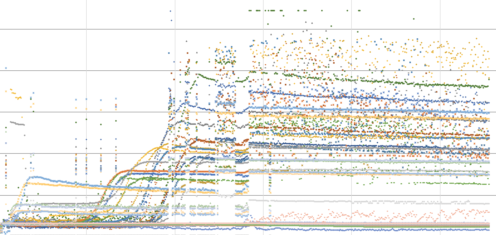

Review:

* Kris installed and tested new circuit boards

* Jess & Kris ran (staggered) sets of culture tubes

* Kellen directing students to go through the code, they’re adding methods (functions) from the code to the wiki on Github, includes descriptions of what each method does (documentation). 

Opening thoughts:

* According to the paper, the LEDs in the ODIn measure at 880nm wavelength:

    * Is this accounted for with OD calibration readings? Jess used OD600 with last week’s readings so these can’t be converted. What’s the justification for using 880nm? 

    * Are Nejc’s samples all done with OD600 + 880? 

    * Is the 880nm wavelength high enough to "cook" samples and damage them? We can calculate the energy generated by the LEDs. 

"Skipping" issue: 

There appear to be two main types of "skips"

1. Near beginning (see four vertical lines) - looks like it’s only 1 point, then corrects

2. Later in the run the entire set "shifts" and continues for bit of time.

Additionally there is a lot of noise at the end of the run, could be biological however notice green points that appear to hit the maximum signal for several points after exponential phase.

Kellen suggests that the "skipping"/ vertical shifts could be a software issue, stemming from a transformation calculation. 

It could possibly be hardware related. It was suggested that the biologists film a run in progress and share with the engineers to observe if there’s any undue strain on the hardware.

Not likely a good explanation, but there could be excess charge in the cables causing errors in readings.

Points reaching maximum might be refraction around the tube? 

Actions:

Engineers are going to finish up the methods descriptions for the code, hopefully will locate potentially a calculation that might be contributing to the skip in readings. 

Look into arduino’s adc (analog inputs) and note that. 

Biologists will collect more new data (test run). Take film of odin in progress. jess will work to improve data viz w/metadata.

