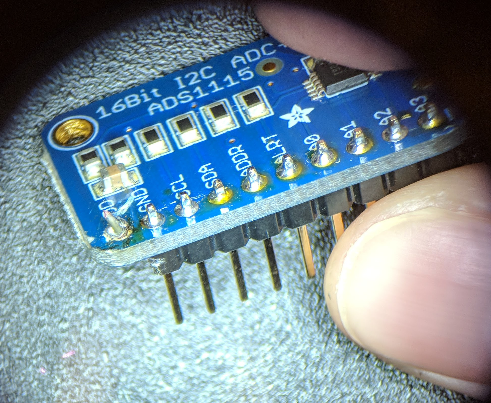

Jh met with Kellen today

[Reviewed recent debug tests](https://docs.google.com/presentation/d/1adEALr0bD0Zs8bln6-g41hCmiqofD1ql5sYCVvGe7H8/edit#slide=id.p)

Troubleshooting with the board we took the odin into machine shop

We tested the voltages on board (w/o hobo), they’re correct (as previously noted)

Hobo meter readings were off, we couldn’t pinpoint a specific connection that was weak. However opening the box and closing would sometimes make all readings go to 0, 0, 0, 5.0V - not reproducible.

Checking the voltages on the cable tips (going into hobo meter) it was noted that the voltages are a 10% step down from actual. This could just be how the hobo is calibrates.

Kellen soldered the (accessible) side of the serial ports for the racks because some of the points looked like they didn’t have enough solder

16-bit ADC chip (the one nearest the arduino) - Power connection (pad) appeared unseated from the board so Kellen replaced it with a new one we had on hand

||
| ------------- |
|Close-up of the unseated connection (on left corner of chip)|

Hobo connection to 5.5vtest on the board is weak, kellen added solder to the connection (where the heat shrink holding wires together is) and this instantly improved the hobo readings. Suggested that we eventually replace the wire to the 5.5vtest because it’s a small prototyping wire 

Kellen said we can replace the switches with a different design that might be more modular

Also suggested ribbon wires instead of the loose ones we have but this is optional
