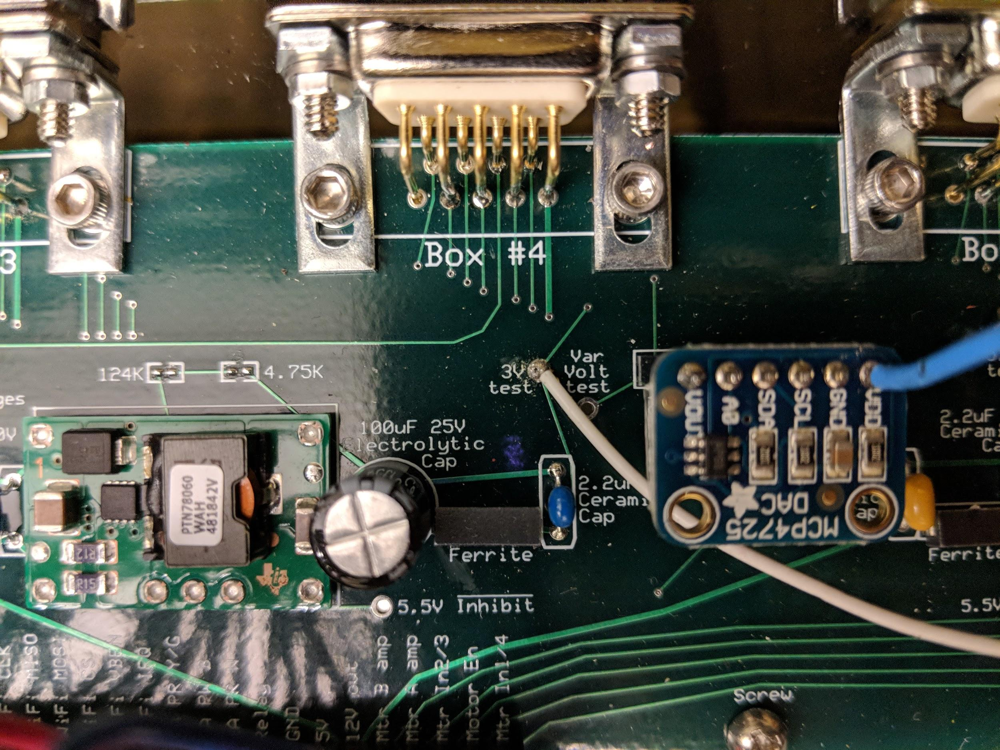

Background:

* Not sure about previous users (Jesse) but we could look at his data in FM

    * I think there were some issues/inconsistencies

* In ~January Kris installed new boards in all of the racks.

* Jess/Kris started using around November/December 2017

* 1/8/18: ([Readme](https://docs.google.com/document/d/16XBmaqgHvGdq9w9lg-T8LEGMvaGZa346TNY-Rc9HvA8/edit)) I ran a test of different monoculture tubes in the ODIn. Results looked as expected (in FM)

* ~1/19/18 Kris Added Gorilla tape to protect boards from tubes in case of breakage.

* 2/12/18: ([Readme](https://docs.google.com/document/d/1X1KvAhVgjozSTg94krPBXz324lcJp4PxoBYQvj9r_g4/edit#heading=h.xsj3qg3zlawf)) My first run of co-cultures looked ok (very similar)

* 3/7/18: ([Readme](https://docs.google.com/document/d/1TmCx7lVWDvoh6U2nTP7f69Uf_CTbfRYDuXqEBA5gBBE/edit#heading=h.r4qpq9wlcaq3)) On the next run I had left one of the racks unplugged, as it gave odd results - this resulted in all of the "debugging" operations we’ve done to this point

Slides for debugging attempts [here](https://docs.google.com/presentation/d/1adEALr0bD0Zs8bln6-g41hCmiqofD1ql5sYCVvGe7H8/edit?usp=sharing).

* 3/11/18: ([Readme](https://docs.google.com/document/d/1TmCx7lVWDvoh6U2nTP7f69Uf_CTbfRYDuXqEBA5gBBE/edit#heading=h.r4qpq9wlcaq3)) To re-test ODIn with all racks plugged in I used a batch inoculation of DvH. The growth curves looked suspiciously similar, and there was suspicion that the signal may have been copying across channels. Voltages were normal.

* 3/19/18: ([Readme](https://docs.google.com/document/d/1g0f05zAb7fVKrgvETJVLtHWdDzqQkparheshdihKZiM/edit)) Trying to understand ODIn’s logic. Looked at voltage meter and data under different conditions - empty tubes, this or that unplugged. **Also replaced  rack board G. Noticed error in hoboreader readings (all at 0, but machine working) d/t opening the box. **

* 3/20/18 ([Spreadsheet](https://drive.google.com/file/d/137u2up0uwR0qBt_8ZaIeGOB_xjHtzoVt/view?usp=sharing)) Ran colorimetric standards to see if there’s a linear response and if any channels are not working properly. Seemed to have an upper limit of OD600 0.400 but more questions arose. **At this time Kris shared that some debug readings between different switches to racks didn’t correctly display. **[Recorded this issue later on github](https://github.com/jmicrobe/odin/issues/25).

* 3/29/18 ([Readme](https://docs.google.com/document/d/1KcAZzwcuiv6q0Vs0g1g4X5dheb2TEtbeNgjgQ53texU/edit)) Ran turbidity standards (McFarland). **Noted difficulty in "debug" mode - readings all saturated. **Ran standards in the “run” mode and just swapped out.

* 3/30/18 ([Notes](https://docs.google.com/document/d/167E7AiSk0N2fYeowXku6PrtTLn2sLCSaY3uLWVN99dg/edit)) Had a meeting with EE volunteer, replaced the 16-bit ADC chip as it looked unseated. Also tried to correct **weak solder points for the hobometer.**

* 4/6/18: ([Readme](https://docs.google.com/document/d/15ufefVCs8JtoZvMS1UPRO8tWnRooRk5q2G_-UwkwgXc/edit)) Based on standards tests, one **LED pair in rack G was replaced**. Later on 4/12/18 **two pairs in rack E were replaced**. (*rack E board may have been replaced as well, not logged but we can check the board).

* 4/24/18: [Github issue reported](https://github.com/jmicrobe/odin/issues/26) - **Problem with channels being saturated has increased**, ODIn was inoperable all day and just started working after several restarts.

* 5/2/18: ([Readme](https://docs.google.com/document/d/1395RCLi3NkcFCXyzMTmVl2hNP-InboDenR2UlAQvivw/edit)) Documentation needs updating, but on this day we attempted to fix the debug mode rotary switch. **Switch was tested then replaced**. Kris then corrected several connections in the ODIn. This did not seem to fix the problem. ODIn was run overnight.

* 5/3/18: (**Documentation needed**) Readings from ODIn all showed "drift". At this point Kris brought the machine in his office for easier debugging.

---

Jess’ notes:

Having a rack unplugged should not be a problem for the system to run

Discussing sensor circuit design
When racks are unplugged there's no telling what value it will calibrate to.

Discussion of software 
Compiling it on jf's computer
Plugged in Arduino
Looking for serial output

Serial output notes: Best pwm is the value the DC is using to get calibration. "Post with modulation". Analog voltage is what's used for calibration purposes. Should be anything from 0-4,095. 

To do: Add library files and the software (Arduino) to repo

Jf says some issues endemic:
Drift down of milA over time

**Investigating interrupt for debug switch**

In serial output: voltages were consistent with switching to different rack, but interrupt command was not always working. JF suggested this could be a problem with the interrupt on the arduino mega. We could replace it, but for now he’ll just remove interrupt from code and replace with a check loop.

**Investigating saturated values at startup**

Next time if values are all saturated: 
Check hobometer, check GND and VDD on 16-bit ADC. *Value should constantly change and not remain stable (see rack C and E notes)
*Unplug linear actuator
Circuit simulators located in JF files as .jar files


Rack A:
Led voltage goes up while plugged in


rack C and E:
No voltage problems
But when plugged in all readings go saturated, even after baseline.
Calibration voltage checked, is incorrect.
Should be constant changing because each channel is different
In this case it was stable at 3.2, which is also a high value
Use "var volt test" to check this:




Calibration circuit 
Op-amp bad
